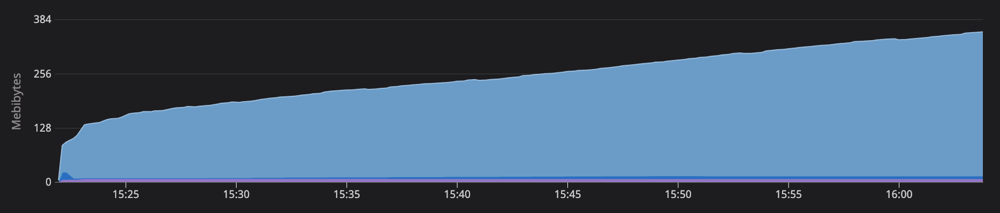
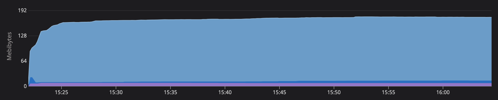

# Python memory leak example app

This repo houses two versions of an example [Flask] application. That application is a simple
key/value cache service. Both the key and the value can be any string and there are just two
operations:

* `GET` requests to `/cache/:key` fetch the current value for the key (404 if no value exists)
* `PUT` requests to `/cache/:key` write a new value for that key

One version, [`leaky_cache`](./leaky_cache), has a terrible memory leak that is sure to cause you
major headaches; the other version, [`well_behaved_cache`](./well_behaved_cache), on the other hand,
has a very stable memory footprint. The core difference between the two versions is this:

* The `leaky_cache` service uses a simple Python dictionary to store cache items (see [this
  line][leaky]). That dictionary grows without bound. When using Datadog APM to track memory usage,
  you can see a linear, monotonic increase in memory usage (until the service crashes 💀).
* The `well_behaved_cache` service uses the [`expiringdict`][expiringdict] library to provide object
  expiry in the cache, limiting the caching dictionary to a maximum or 1,000 items or a TTL of 60
  seconds. This keeps the cache from growing in an unbounded fashion, which leads to a fairly smooth
  memory profile in APM.

The caching service is utilized by an async HTTP [client] that continuously writes randomly
generated strings to the cache as fast it can get away with. The current configuration runs 10
instances of the client for each version of the service.

## Visual comparison

The "leaky" service:



The "well-behaved" service:



## Prerequisites

The only real prerequisites to run the service(s) locally are to have [Docker] and [Docker Compose] 
installed and the Docker daemon running on your machine.

## Running the scenario

To run the full scenario locally:

```shell
docker-compose up --build --detach
```

This starts up many containers:

* One container each for the [`leaky_cache`](./leaky_cache) service and the
  [`well_behaved_cache`](./well_behaved_cache) service.
* 10 containers each for the client (each service has 10 dedicated clients hitting it with writes).
* A [Datadog Agent][agent] collecting traces from both versions of the service (though not from the
  client processes).

### Payload size

The HTTP clients interacting with the different versions of the caching service write strings that
are 10,000 characters long by default. You can change that on a per-client basis by updating the
`PAYLOAD_SIZE` environment variable in the [Docker Compose config][yaml].

## Monitoring

This scenario is built to be monitored by Datadog's APM service. But you can do some simple
monitoring of your own locally using the `/info` endpoint, which exposes two pieces of information:

1. The current number of items stored in the cache
2. The total current size (in bytes) of the cache

A shell loop like this would enable you to monitor the service:

```shell
while true; do curl http://localhost:8080/info; sleep 60; done
```

Note the delay of 60 seconds between calls to the `/info` endpoint. Over time, the "leaky" cache
should contain more and more items, whereas the "well-behaved" cache should have roughly the same
number of items from minute to minute (due to expiry).

[agent]: https://docs.datadog.com/agent
[client]: ./client
[docker]: https://docker.com
[docker compose]: https://docs.docker.com/compose
[expiringdict]: https://github.com/mailgun/expiringdict
[flask]: https://flask.palletsprojects.com
[leaky]: ./leaky_cache/app.py#L11
[well_behaved]: ./well_behaved_cache/app.py#L12
[yaml]: ./docker-compose.yml